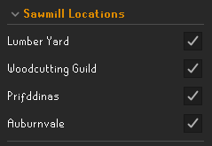

# Log Basket Swapper v1.0  

## Description

A plugin for swapping the left-click option on the Log Basket to _Empty_ when near a sawmill.

The plugin supports both the Log Basket and the Forestry Basket.

This is useful when making planks at a sawmill with a Log/Forestry Basket in combination with a Plank Sack.

## Features

- Support Log Basket and Forestry Basket.
- Ability to configure which sawmill locations are active.

    
